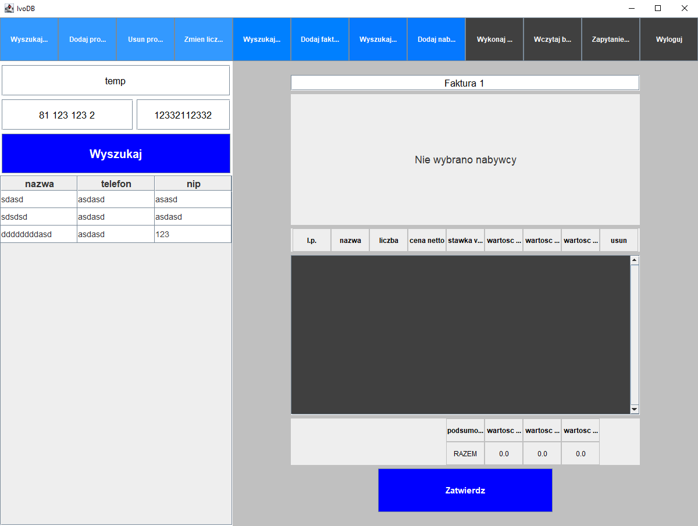

# IvoDB | 2020

## O Projekcie
IvoDB to aplikacja oferująca interfejs graficzny do zarządzania bazą magazynu. Z poziomu aplikacji możemy wyszukiwać, usuwać lub dodawać nowe produkty, zarządzać listą klientów oraz wiele innych. Aplikacja oferuje możliwość tworzenia faktur, automatycznie uzupełniając niektóre pola na podstawie danych z bazy.  
IvoDB działa na kliku trybach dostępu. W zależności od trybu zalogowany użytkownik ma pełny lub ograniczony dostęp do niektórych funkcjonalności, na przykład samodzielne formułowanie zapytań SQL.  
  

## Wykorzystane narzędzia
* Java 15
* Swing
* Hibernate 4.1.9
* MySQL 8.0.22
